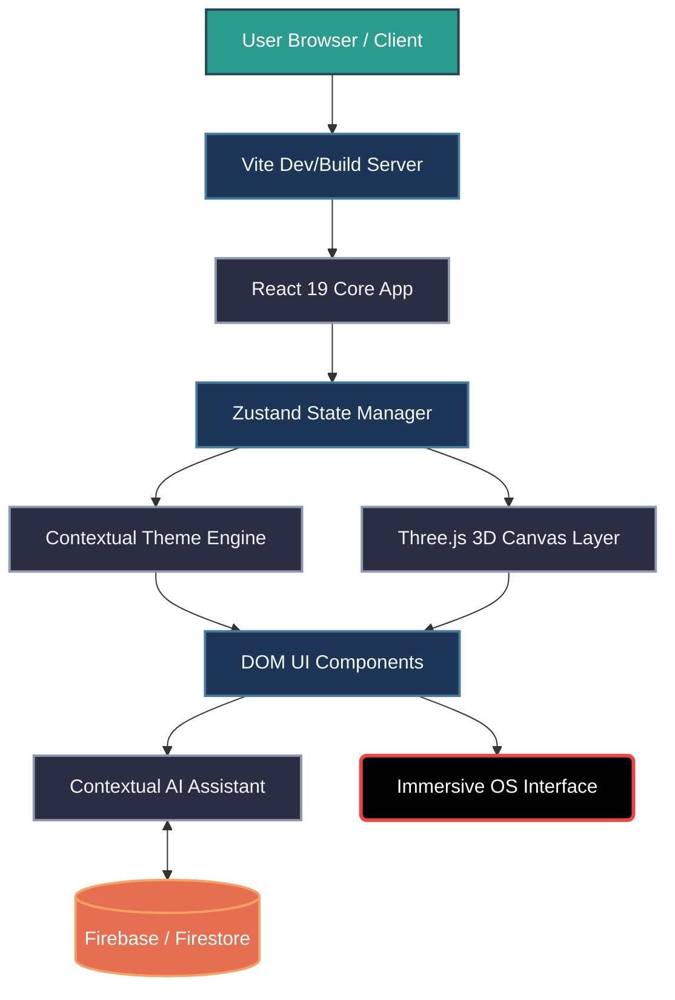

<div align="center">
  

# 🌌 LUMINA OS

[](https://reactjs.org/)
[](https://vitejs.dev/)
[](https://threejs.org/)
[](https://firebase.google.com/)
[](https://opensource.org/licenses/MIT)

**Lumina OS is a AAA-grade, high-fidelity web application built to simulate a next-generation gaming hub and agentic intelligent assistant interface. It features interactive 3D elements, dynamic contextual theming, and a highly immersive, video game-inspired user experience.**

</div>

---

## 🌟 Overview

Lumina OS bridges the gap between web development and game design, delivering a seamless, high-performance portal for gamers. The platform reacts dynamically to the user's active game choice, completely overhauling the UI/UX environment—from color palettes and ambient particle effects to the personality of the built-in AI assistant. Whether navigating through Norse runes for *God of War* or digital scanlines for *Assassin's Creed*, the OS acts as a living, breathing interface that prioritizes immersion and speed.

### 🧠 Core Capabilities & Tech Stack

* **Cinematic Omni-Theme Boot Sequence:** A physics-based, high-performance loading state utilizing cubic-bezier animations, SVG hex grids, and floating particles that cycle through the featured game aesthetics.
* **Dynamic Contextual Theming System:** Instantaneous UI overhauls triggered by game selection, applying unique visual effects (e.g., emerald glows and magic orbs for *Hogwarts Legacy*, security laser sweeps for *Hitman*).
* **Agentic AI Assistant:** A contextual chat interface that dynamically shifts personas (e.g., Mimir or Diana) based on the active hub, simulating live data streams with cinematic "Uplink" splash animations.
* **Immersive 3D Rendering (React Three Fiber):** Integration of `.glb` models and post-processing effects directly into the web canvas, bringing the gaming hub to life without sacrificing browser performance.
* **Optimized Game Data Persistence:** Leveraging `Zustand` and Session Storage for instantaneous state management, ensuring lightning-fast load times when traversing detailed lore, arsenals, and publishing roadmaps.

---

## 🏛️ Master Architecture



---

## 📁 Repository Structure

```text
Lumina_Os/
├── backend/
│   ├── config/                  # Firebase and LLM API configurations
│   ├── routes/                  # API endpoints for AI assistant & game data
│   ├── server.js                # Node/Express server entry point
│   └── package.json             # Backend dependencies & scripts
├── frontend/
│   ├── public/
│   │   ├── assets/              # UI textures, icons, and SVG hex grids
│   │   └── models/              # Heavy 3D .glb assets (Draco compressed)
│   ├── src/
│   │   ├── components/          # Reusable UI (Hub, CinematicSlider, Chat)
│   │   ├── context/             # React context providers
│   │   ├── store/               # Zustand state slices (theme, user, chat)
│   │   ├── styles/              # Global CSS, CSS Variables, Tailwind
│   │   ├── utils/               # Animation helpers, Framer Motion variants
│   │   ├── App.jsx              # Main routing and canvas mounting
│   │   └── main.jsx             # React DOM root injection
│   ├── index.html               # Main HTML entry template
│   ├── package.json             # Dependencies and scripts
│   └── vite.config.js           # Vite bundler configuration
└── README.md                    # Project documentation
```

---

## 🚀 The Automated Pipeline

**Phase 1: Boot Sequence & Asset Hydration**
When the application is launched, the `Vite` server serves the initial payload. The Cinematic Omni-Theme Boot Sequence triggers immediately, rendering a physics-based loading screen while heavy `.glb` models and textures are fetched asynchronously in the background.

**Phase 2: State Initialization & Thematic Binding**
Once assets are cached, `Zustand` checks session storage for the user's last active game state. The Dynamic Theme Engine injects the appropriate CSS variables (e.g., Cyan for God of War, Crimson for RDR2) globally, updating the DOM and preparing the particle effects for the 3D canvas.

**Phase 3: 3D Canvas Render Loop**
`React Three Fiber` mounts the `<Canvas>` component. Lighting, post-processing (bloom, ambient occlusion), and specific 3D elements (falling runes, memory fragments) are instantiated based on the active theme state passed down from the store.

**Phase 4: Agentic Uplink Integration**
The UI layer renders the Game Data Hub and the Interactive AI Assistant. The assistant connects to the backend API, initializing its system prompt to adopt the persona of the currently selected game. Firebase/Firestore syncs the chat history and timestamp tracking, displaying a cinematic "Uplink Established" animation before accepting user input.

---

## ⚙️ Hardware / System Requirements

* **Operating System:** Windows 10/11, macOS 12+, or modern Linux distributions.
* **Node Environment:** Node.js v18.0.0 or higher.
* **Package Manager:** NPM (bundled with Node) or Yarn/pnpm.
* **Browser:** A modern, WebGL2-compatible web browser (Chrome, Edge, Firefox, Safari) with hardware acceleration enabled for smooth 3D rendering.
* **Graphics:** A dedicated GPU or modern integrated graphics capable of rendering Three.js post-processing effects at 60fps.

---

<div align="center">
  <i>Built with ☕ and ❤️ for Next-Generation Immersive Web Experiences.</i>
</div>
