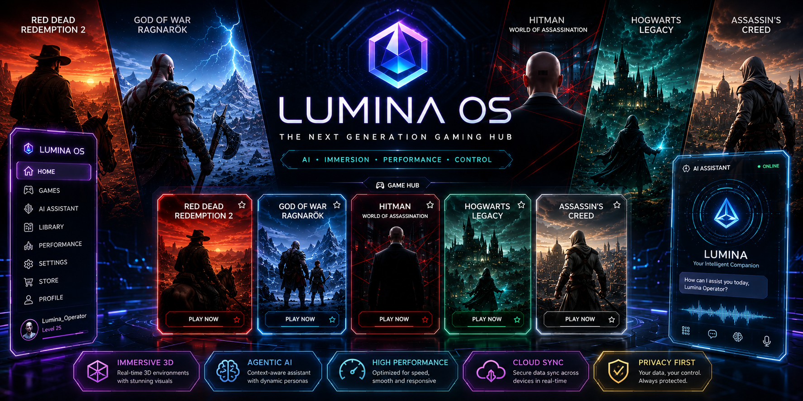
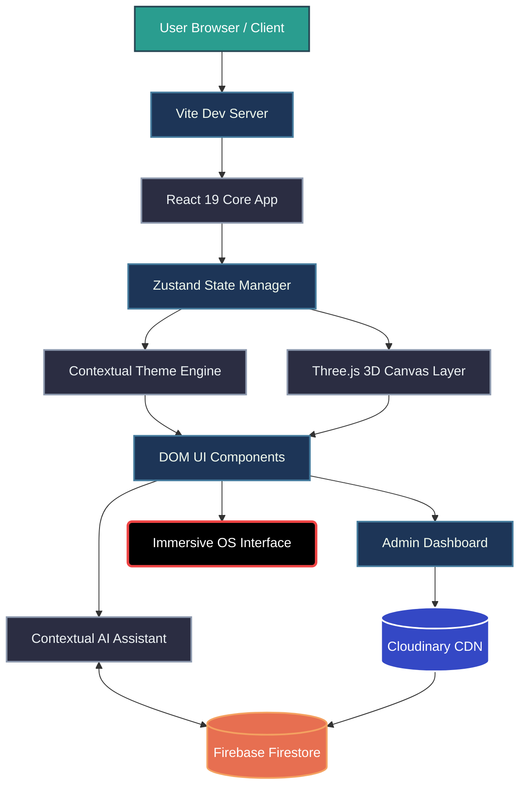
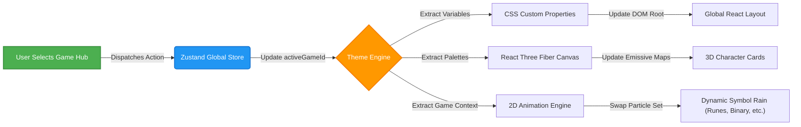
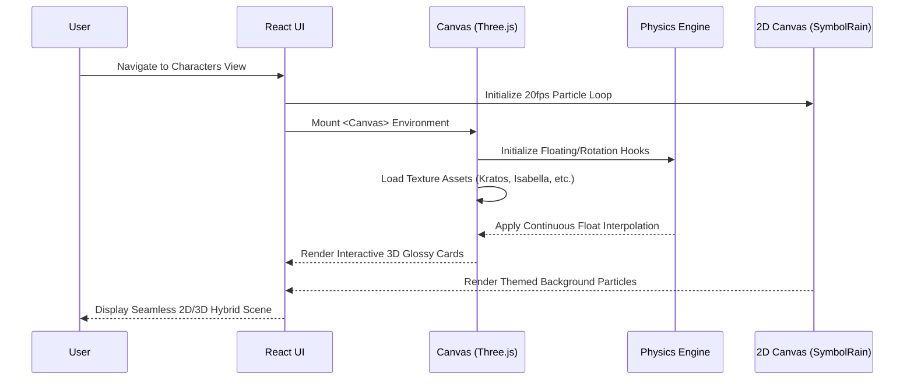

<div align="center">
  

# 🌌 LUMINA OS

[](https://reactjs.org/)
[](https://vitejs.dev/)
[](https://threejs.org/)
[](https://firebase.google.com/)
[](#)
[](https://cloudinary.com/)
[](https://opensource.org/licenses/MIT)

**Lumina OS is a AAA-grade, high-fidelity web application built to simulate a next-generation gaming hub and agentic intelligent assistant interface. It features interactive 3D elements, dynamic contextual theming, and a highly immersive, video game-inspired user experience.**

</div>

---

## 🌟 Overview

Lumina OS bridges the gap between web development and game design, delivering a seamless, high-performance portal for gamers. The platform reacts dynamically to the user's active game choice, completely overhauling the UI/UX environment—from color palettes and ambient particle effects to the personality of the built-in AI assistant. Whether navigating through Norse runes for *God of War* or digital scanlines for *Assassin's Creed*, the OS acts as a living, breathing interface that prioritizes immersion and speed.

### 🧠 Core Capabilities & Tech Stack

* **Cinematic Omni-Theme Boot Sequence:** A physics-based, high-performance loading state utilizing cubic-bezier animations, SVG hex grids, and floating particles that cycle through the featured game aesthetics.
* **Dynamic Contextual Theming System:** Instantaneous UI overhauls triggered by game selection, applying unique visual effects (e.g., emerald glows and magic orbs for *Hogwarts Legacy*, security laser sweeps for *Hitman*).
* **Agentic AI Assistant:** A contextual chat interface that dynamically shifts personas (e.g., Mimir or Diana) based on the active hub, simulating live data streams with cinematic "Uplink" splash animations.
* **Immersive 3D Rendering & Holograms (React Three Fiber):** Integration of interactive 3D elements, such as glossy rotating character cards, floating holographic projections, and custom particle engines (like the dynamic game-specific Symbol Rain) directly into the DOM.
* **Admin Dashboard & Cloud Sync:** A fully secured Admin mode allowing authorized users to edit game metadata, upload cover art via Cloudinary, and instantly sync changes across all clients via Firebase Firestore.

---

## 🚀 Getting Started

Follow these instructions to set up Lumina OS locally.

### Prerequisites
* **Node.js** (v18.0.0 or higher)
* **npm** (v9.0.0 or higher)
* A **Firebase** Account (Firestore Database)
* A **Cloudinary** Account (For Image Uploads)

### Installation
1. Clone the repository:
   ```bash
   git clone https://github.com/your-username/Lumina_OS.git
   cd Lumina_OS/frontend
   ```

2. Install dependencies:
   ```bash
   npm install
   ```

3. Configure Environment Variables:
   Create a `.env` or `.env.local` file in the `frontend` directory and add your Firebase credentials:
   ```env
   VITE_FIREBASE_API_KEY=your_api_key
   VITE_FIREBASE_AUTH_DOMAIN=your_auth_domain
   VITE_FIREBASE_PROJECT_ID=your_project_id
   VITE_FIREBASE_STORAGE_BUCKET=your_storage_bucket
   VITE_FIREBASE_MESSAGING_SENDER_ID=your_messaging_sender_id
   VITE_FIREBASE_APP_ID=your_app_id
   ```
   *(Note: Cloudinary Cloud Name and Upload Presets are currently configured directly within the Admin UI upload handlers).*

4. Run the development server:
   ```bash
   npm run dev
   ```

---

## 🏛️ Architecture & Flowcharts

Lumina OS utilizes multiple specialized micro-architectures that work in tandem to provide a robust, state-driven, and highly visual experience.

### 1. Master System Architecture



### 2. Contextual Theme Injection Pipeline

This flowchart outlines how Lumina OS dynamically alters its entire visual identity when a user switches the active game hub (e.g., from God of War to Hitman).



### 3. High-Fidelity 3D Rendering Pipeline

Lumina OS utilizes `react-three-fiber` and `drei` to render physically based 3D elements inside the standard React component tree.



---

## 🔄 The Full Automated Pipeline

Lumina OS operates on a highly optimized, multi-phase rendering and data synchronization pipeline.

### Phase 1: Boot Sequence & Asset Hydration
When the application is launched, the `Vite` server serves the initial payload. The Cinematic Omni-Theme Boot Sequence triggers immediately, rendering a physics-based loading screen. Meanwhile, heavy `.glb` models, High-Res textures, and structural data are fetched asynchronously in the background to ensure zero blocking of the main thread.

### Phase 2: State Initialization & Thematic Binding
Once core assets are cached, `Zustand` mounts the global store, checking session storage for the user's last active game state. The Dynamic Theme Engine immediately injects the appropriate CSS variables (e.g., Cyan for God of War, Crimson for RDR2) into the DOM, swapping out typography, hover states, and ambient particle colors across the entire OS.

### Phase 3: 3D Canvas Render Loop & Responsive Projection
`React Three Fiber` mounts the global `<Canvas>` component. Lighting, post-processing (bloom, ambient occlusion), and specific 3D elements (falling runes, memory fragments) are instantiated. Complex 3D mathematical alignments are recalculated in real-time within the `useFrame` loop, ensuring perfect visual fidelity across all aspect ratios. We also employ hybrid 2D Canvas overlays (like the animated SymbolRain) mapped behind the 3D `<Canvas>` to save WebGL memory while maximizing aesthetics.

### Phase 4: Admin Dashboard & Cloud Asset Synchronization
Authorized users can access the Admin Dashboard to modify game metadata. 
1. When an Admin uploads new promotional art, the payload is securely POSTed directly to the **Cloudinary CDN**.
2. Cloudinary processes the file and returns a lightweight, optimized `secure_url`.
3. The application automatically intercepts this URL and triggers an **Auto-Save** to **Firebase Firestore**.
4. Firebase emits a real-time snapshot update, pushing the textual and image link changes instantly to all connected clients globally without requiring a page refresh.

### Phase 5: Agentic Uplink Integration
The UI layer renders the Game Data Hub and the Interactive AI Assistant. The assistant connects to the backend API, initializing its system prompt to adopt the persona of the currently selected game. Firebase/Firestore syncs the chat history and timestamp tracking, displaying a cinematic "Uplink Established" animation before accepting user input.

---

## 📁 Repository Structure

```text
Lumina_Os/
├── backend/
│   ├── config/                  # Firebase and LLM API configurations
│   ├── routes/                  # API endpoints for AI assistant & game data
│   ├── server.js                # Node/Express server entry point
│   └── package.json             # Backend dependencies & scripts
├── frontend/
│   ├── public/
│   │   ├── assets/              # UI textures, icons, and SVG hex grids
│   │   ├── images/              # Local curated Hero Backgrounds
│   │   └── cards/               # UI Character Cards (Agent47, Isabella, Kratos)
│   ├── src/
│   │   ├── components/          # Reusable UI (Hub, CinematicSlider, Chat)
│   │   ├── config/              # Firebase Initialization
│   │   ├── store/               # Zustand state slices (theme, user, chat)
│   │   ├── UI_Files/            # Core Views (CharactersView, Dashboard)
│   │   ├── styles/              # Global CSS, CSS Variables, Tailwind
│   │   ├── utils/               # Animation helpers, Framer Motion variants
│   │   ├── App.jsx              # Main routing and canvas mounting
│   │   └── main.jsx             # React DOM root injection
│   ├── index.html               # Main HTML entry template
│   ├── package.json             # Dependencies and scripts
│   └── vite.config.js           # Vite bundler configuration
└── README.md                    # Project documentation
```

---

## ⚙️ Hardware / System Requirements

* **Operating System:** Windows 10/11, macOS 12+, or modern Linux distributions.
* **Browser:** A modern, WebGL2-compatible web browser (Chrome, Edge, Firefox, Safari) with hardware acceleration enabled for smooth 3D rendering.
* **Graphics:** A dedicated GPU or modern integrated graphics capable of rendering Three.js post-processing effects at 60fps.

---

## 📄 License

This project is licensed under the MIT License. See the [LICENSE](LICENSE) file for details.

---

<div align="center">
  <i>Built with ☕ and ❤️ for Next-Generation Immersive Web Experiences.</i>
</div>