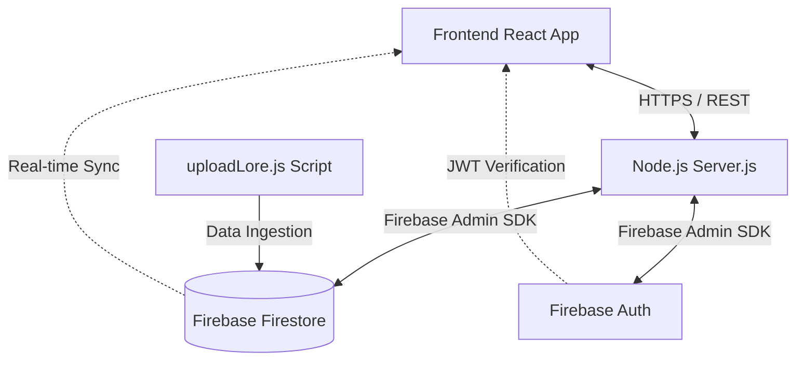

# Lumina OS - Backend Architecture

Welcome to the backend repository of **Lumina OS**. This Node.js server acts as the central hub for managing data ingestion, authentication integration, and lore management for the Lumina OS ecosystem.

## 🚀 Tech Stack
- **Runtime:** Node.js
- **Database / BaaS:** Firebase (Authentication, Firestore, Storage)
- **Environment:** dotenv for secure secret management

## 🧠 Core Features

### 1. Lore & Data Management
The backend is responsible for processing and uploading rich narrative lore, character backgrounds, and universe data into the centralized database using scripts like `uploadLore.js`. This ensures that the dynamic frontend always receives the most up-to-date content without hardcoding large JSON blocks on the client.

### 2. Centralized API Server (server.js)
Acts as the primary secure gateway for the Lumina OS frontend. It handles specialized requests, third-party API integrations, and ensures that sensitive Firebase Admin SDK operations are securely executed server-side.

## 🏗️ Architecture Flowchart

## 📂 Directory Structure Highlights
- `server.js` - The main Express entry point and server logic.
- `uploadLore.js` - Utility script for batch uploading lore data to Firestore.
- `package.json` - Backend dependencies and run scripts.
- `.env` - (Gitignored) Contains sensitive Firebase Admin credentials and environment variables.

## 🛠️ Getting Started
1. `npm install`
2. Ensure you have your `.env` file correctly configured with Firebase credentials.
3. `node server.js` to start the backend.
4. To ingest new lore data, run `node uploadLore.js`.
