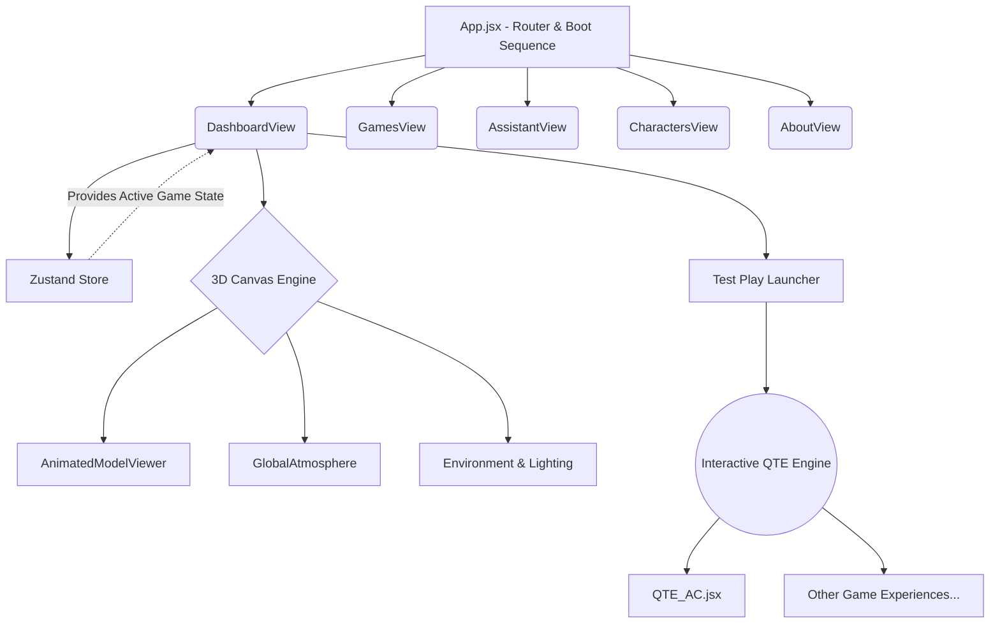

# Lumina OS - Frontend Architecture

Welcome to the frontend repository of **Lumina OS**. This project is a next-generation, high-performance web operating system built with a massive focus on 3D aesthetics, cinematic interactions, and AAA gaming UI elements. 

## 🚀 Tech Stack
- **Framework:** React + Vite
- **3D Engine:** React Three Fiber (R3F) & Drei (Three.js)
- **State Management:** Zustand
- **Authentication:** Firebase Auth
- **Styling:** Vanilla CSS (Glassmorphism, Neon Cyberpunk Aesthetics)

## 🎮 Core Features

### 1. Dynamic 3D Dashboard
The core interface features a massive scrolling ecosystem where different gaming universes (God of War, Assassin's Creed, Hogwarts Legacy, Red Dead Redemption, Hitman) crossfade beautifully. Each universe dynamically loads its own custom `.glb` 3D model (like the Leviathan Axe or Hidden Blade) that floats in 3D space with post-processing effects, environmental lighting, and dynamic shadows.

### 2. Multi-Sequence QTE Video Engine
A custom-built interactive cinematic video player that mimics AAA quick-time events (QTEs). The engine supports data-driven arrays to trigger perfect cinematic time dilations, pauses, and interactive prompts (e.g., `[SPACE] JUMP`, `[E] ASSASSINATE`). It leverages native HTML5 video integrated with React state and browser Fullscreen APIs for deep immersion.

### 3. Cyber-Boot Sequence
A custom boot sequence that hooks into the actual real-time download progress (`useProgress`) of the heavy WebGL assets, holding the user in a slick loading screen until the GPU is fully primed.

## 🏗️ Architecture Flowchart

## 📂 Directory Structure Highlights
- `src/UI_Files/DASHBOARD/` - Core 3D Dashboard and Canvas logic.
- `src/Test_Play/` - Dedicated cinematic mini-games and QTE logic for each franchise.
- `src/store/` - Zustand global state management.
- `public/models/` - Draco-compressed `.glb` 3D assets.
- `public/Test_Plays/` - Large `.mp4` cinematic video files (gitignored).

## 🛠️ Getting Started
1. `npm install`
2. `npm run dev`
3. If WebGL context is lost during intense HMR, perform a hard refresh (F5).
